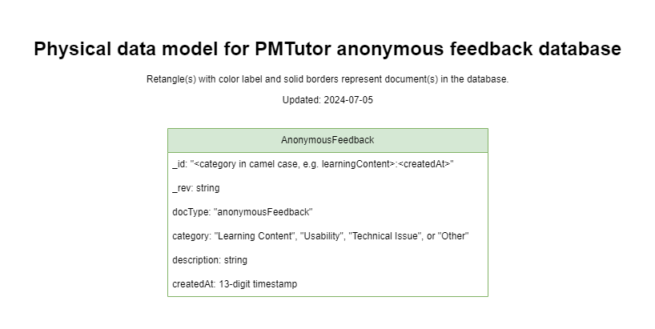

# Erasmus+ ChatLearn PMTutor cloudant databases
This repository provides information on the design of PMTutor databases and python scripts for creating required databases.

## Table of Contents
- [Conceptual data model](#conceptual-data-model)
- [IBM Cloudant](#ibm-cloudant)
- [Physical data models](#physical-data-models)
- [Prerequisites for creating databases](#prerequisites-for-creating-databases)
- [Python scripts (Windows)](#python-scripts-windows)
- [Python scripts (Ubuntu)](#python-scripts-ubuntu)
- [After creating databases](#after-creating-databases)
- [License](#license)

## Conceptual data model
The data models were designed iteratively and incrementally during the project&mdash;requirements inform and update the 
conceptual data model. Based on the conceptual data model, physical data models are elaborated and might further update the conceptual model.
A diagram tool, [draw.io](https://www.drawio.com/) was used for data modeling and other design activities. The figure below shows 
the latest conceptual data model, which facilitates the majority of [PMTutor use cases](https://github.com/erasmus-chatlearn/pmtutor-watsonx-assistant-configurations/blob/main/README.md).


## IBM Cloudant
IBM Cloudant was chosen for the database implementation. It is a fully managed and distributed document database service designed 
for heavy workloads and fast-growing web and mobile applications. It offers elastic scalability for both throughput and 
storage, ensuring high availability. Cloudant is API-compatible with Apache CouchDB, facilitating hybrid and multicloud
architectures. Key features include data encryption, global data distribution for disaster recovery, and support for 
various programming languages, including Java, Node.js, Python, and Swift. Ideal for serverless and mobile applications, 
Cloudant ensures seamless data synchronization and high performance.

Cloudant's indexing feature supports advanced query capabilities, allowing efficient searches across large datasets. 
It enables developers to create indexes for faster retrieval of documents based on specified criteria. This feature is 
crucial for optimizing performance in applications that require complex querying and real-time data access.

Databases can be managed by authorized users through a web browser in addition to programming scripts. Below shows an example of querying 
all exercises by a learning topic, Earned Valued Management, through a browser.


During the project, databases were managed through both programming scripts and web browser.

Below are useful links for working with the database service:
- [General information](https://www.ibm.com/products/cloudant)
- [Service documentation](https://cloud.ibm.com/docs/Cloudant?topic=Cloudant-getting-started-with-cloudant)
- [API documentation](https://cloud.ibm.com/apidocs/cloudant)

## Physical data models
PMTutor physical data models are foundational&mdash;they dictate required data structures and document relations for
[the content management tool set](https://github.com/erasmus-chatlearn/pmtutor-content-management) when parsing configurations, 
and for [the webhook middleware](https://github.com/erasmus-chatlearn/pmtutor-webhook) when storing data during a user session.  
The data models were designed considering PMTutor requirements and [the best practices for IBM Cloudant](https://cloud.ibm.com/docs/Cloudant?topic=Cloudant-data-modeling).
It was decided in the early phase of project by the development team to store data in 4 databases, one for each of the 
following purpose: learning content, user profile, user session events, and feedback. To assist data management and 
further database development, the latest physical data model diagram for each database is collected in this section. These diagrams
depict all possible document types you may find in PMTutor databases.

### Physical data model for learning content database


### Physical data model for user profile database


### Physical data model for user session events database


### Physical data model for feedback database


## Prerequisites for creating databases
- IBM Cloudant service
- Python 3.10
- Python virtualenv package
- Create a Python virtual environment&mdash;use the virtual environment for running scripts
- Install requirements.txt in the virtual environment 
- Create a .env file using .env.example as template at the root level of this repository
- Provide required environment variables in the .env

## Python scripts (Windows)
### Create all required databases with default names
The command below will create 4 databases: topics-sandbox, user-profile-sandbox, user-session-events-sandbox, and
feedback-sandbox, if the names have not been taken by other existing databases in your cloudant service. You will see
the information of created databases and their indexes displayed in the terminal.

It will abort if any of the names are used by existing databases.
```bash
python scripts\create_pmtutor_databases.py
```

### Create all required databases with specific names
For example, create required databases for production:
```bash
python scripts\create_pmtutor_databases.py --learning_content topics-prod --user_profile user-profile-prod --user_session_events user-session-events-prod --feedback feedback-prod
```

### Create a new database for a specific purpose
For example, you could create a learning content database for development or testing purpose with the following command.
```bash
# The 1st argument should be 'learning_content', 'user_profile', 'user_session_events', or 'feedback'
# The 2nd argument is the name of database
# It will abort if the arguments are not valid
python scripts\create_pmtutor_database.py 'learning_content' 'topics-dev'
```

## Python scripts (Ubuntu)
### Create all required databases with default names
The command below will create 4 databases: topics-sandbox, user-profile-sandbox, user-session-events-sandbox, and 
feedback-sandbox, if the names have not been taken by other existing databases in your cloudant service. You will see
the information of created databases and their indexes displayed in the terminal.

It will abort if any of the names are used by existing databases.
```bash
python scripts/create_pmtutor_databases.py
```

### Create all required databases with specific names
For example, create required databases for production:
```bash
python scripts/create_pmtutor_databases.py --learning_content topics-prod --user_profile user-profile-prod --user_session_events user-session-events-prod --feedback feedback-prod
```

### Create a new database for a specific purpose
For example, you could create a learning content database for development or testing purpose with the following command.
```bash
# The 1st argument should be 'learning_content', 'user_profile', 'user_session_events', or 'feedback'
# The 2nd argument is the name of database
# It will abort if the arguments are not valid
python scripts/create_pmtutor_database.py 'learning_content' 'topics-dev'
```
## After creating databases
- To upload configurations to the newly created learning content database, you might need to update the database name environment variable 
in [the content management tool](https://github.com/erasmus-chatlearn/pmtutor-content-management).
- For PMTutor watsonx assistant to access newly created databases, you might need to update the variables of database names in
the intended webhook file if the new database names are different from the file, 
e.g., [the latest dev version webhook file](https://github.com/erasmus-chatlearn/pmtutor-webhook/blob/main/services/webhooks/dialog/dialog_2024-0312-dev.js).

## License
MIT
